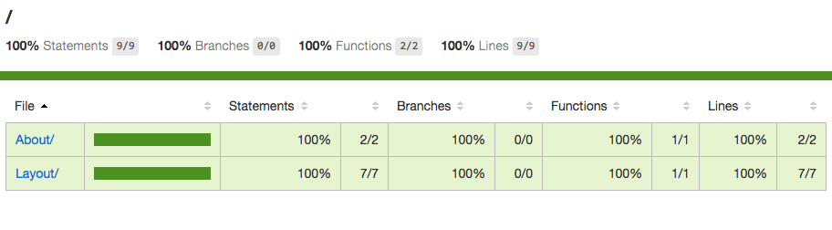
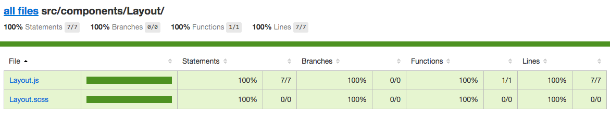
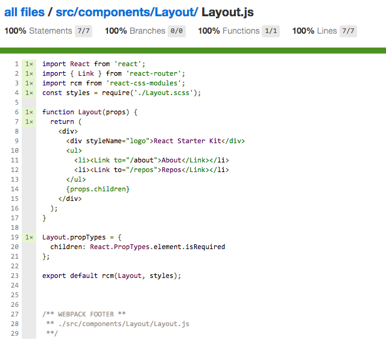

# karma-sourcemap-writer
> Sourcemap writer for karma-webpack to work with istanbul.

## Why
Testing webpack project with [karma-webpack](https://github.com/webpack/karma-webpack) is cool, until you want to use [istanbul](https://github.com/gotwarlost/istanbul) to do code coverage.

## The problem
The codes were transpiled by webpack loaders so the coverage is not accurate.

## The Solution
Use karma-sourcemap-writer to write source map file into right place and let [remap-istanbul](https://github.com/SitePen/remap-istanbul) remap Istanbul code coverage information to its original source positions.





## Install
```
npm install --save-dev karma-sourcemap-writer
```

## Getting started
1. Setup karma-webpack in the [alternative way](https://github.com/webpack/karma-webpack#alternative-usage).
2. Set `devtool` to `inline-source-map`

  ```
  webpack: {
    // ...
      devtool: 'inline-source-map'
  }
  ```

3. Append `sourceMappingURL` to `test.webpack.js`

  ```
  const context = require.context('./test', true, /.spec\.js$/);
  context.keys().forEach(context);
  //# sourceMappingURL=tests.webpack.js.map
  ```

4. Apply `karma-sourcemap-writer` and [`karma-coverage`](https://github.com/karma-runner/karma-coverage)

  ```js
  const webpackConfig = require('./webpack/config.test.js');

  module.exports = function set(config) {
    config.set({
      browsers: ['Chrome'],
      singleRun: true,
      frameworks: ['mocha'],
      files: [
        'tests.webpack.js'
      ],
      preprocessors: {
        'tests.webpack.js': [
          'webpack',
          'sourcemap',
          'sourcemap-writer', // important!
          'coverage'          // important!
        ]
      },
      reporters: ['mocha', 'coverage'],
      webpack: webpackConfig,
      webpackServer: {
        noInfo: true
      },    
      coverageReporter: { // important!
        type: 'json',
        subdir: '.',
        file: 'coverage-final.json'
      },
      plugins: [
        'karma-chrome-launcher',
        'karma-webpack',
        'karma-mocha',
        'karma-mocha-reporter',
        'karma-sourcemap-loader',
        'karma-sourcemap-writer', // important!
        'karma-coverage'          // important!
      ]
    });
  };
  ```

5. Run karma. This will generate `coverage/coverage-final.json` and `tests.webpack.js.map` beside `tests.webpack.js`

  ```
  karma start
  ```

6. Run `remap-istanbul` to generate mapped report

  ```
  remap-istanbul -i coverage/coverage-final.json -o coverage/coverage-remapped.json -t json
  ```

7. Generate clean coverage report
  > At this stage there will be lots of info in the report such as webpack generated code and npm modules, we have to run a script to remove them. Thanks to @otbe for [the solution](https://github.com/SitePen/remap-istanbul/issues/51#issuecomment-216466344).
  

  Create a node script and execute it.

  ```js
  const istanbul = require('istanbul');
  const collector = new istanbul.Collector();
  const reporter = new istanbul.Reporter();

  const remappedJson = require('./coverage/coverage-remapped.json');
  const coverage = Object.keys(remappedJson).reduce((result, source) => {
    if (source.match(/^src\/.*\.js$/)) {
      result[source] = remappedJson[source];
    }

    return result;
  }, {});

  collector.add(coverage);

  reporter.add('html');
  reporter.write(
    collector,
    true,
    () => console.log('open coverage/index.html to see the coverage report.')
  );

  ```
  Done.

## Example project
[React Starter Kit](https://github.com/jas-chen/react-starter-kit)
